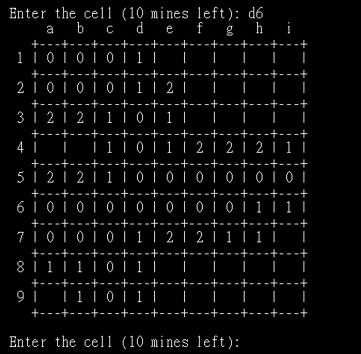
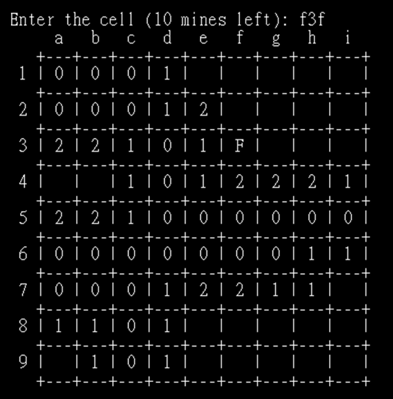
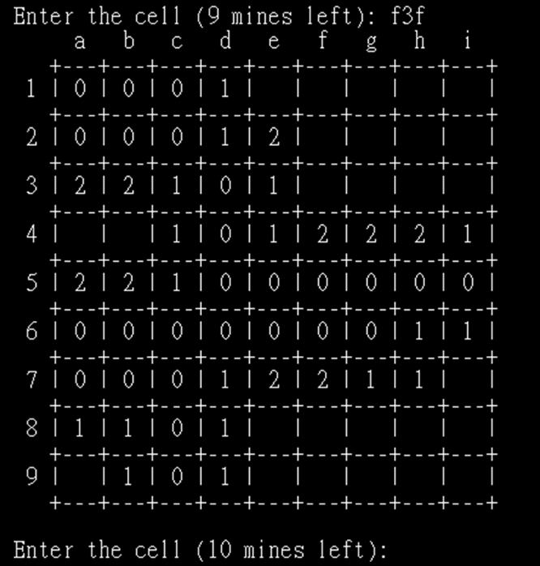
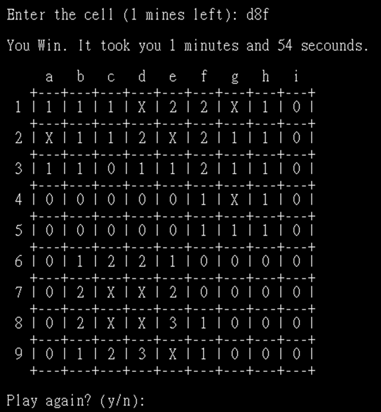

# Python-Games
Some small games written in Python

# 1. Minesweeper 💣 - Command Line Version

## **Game Introduction**
Minesweeper is a classic puzzle game where players must uncover all safe tiles without stepping on any mines.  
This game is a **Python command-line version**, where players input coordinates to interact with the board.

## **Game Rules**
1. **The game board is a 9×9 grid with a total of 81 cells**.
2. **10 mines are randomly placed**, and players must avoid selecting them.
3. **Numbers indicate the number of adjacent mines**:
   - `0`: No mines in the surrounding 8 cells.
   - `1-8`: Indicates the number of mines in the surrounding 8 cells.
   - `F`: A flag placed by the player (indicating a suspected mine).
   - `X`: The player stepped on a mine, and the game is over.
4. **Players input coordinates to select a cell**:
   - For example, `a5` selects **Column A, Row 5**.
   - Inputting `a5f` **places or removes a flag**.
5. **Game Objective**:  
   - Uncover all **non-mine** cells to win.
   - **The first selected cell is always safe**.

---

## **How to Run the Game**
Make sure **Python 3** is installed, download `minesweeper.py`, and execute the following command:
```bash
python "your_path\minesweeper.py"
```

## **Game Examples**
1. **Starting the game**  
   

2. **Input coordinates to select a cell**  
   

3. **Marking a flag**  
    

4. **Winning or Losing the Game**  
   **Lose:**  
     

   **Win:**  
   


