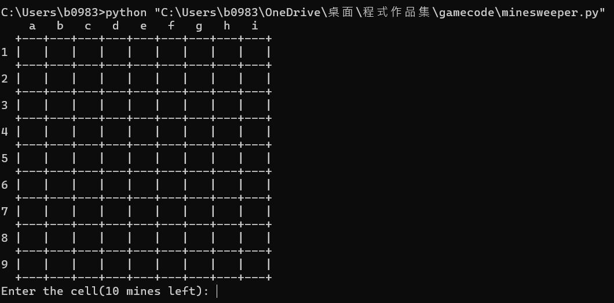
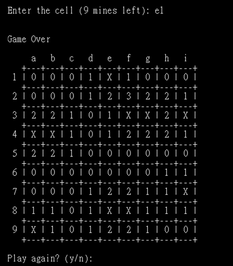

# Python-Games
Some small games written in Python

# 1. Minesweeper 💣 - Command Line Version

## **Game Introduction**
Minesweeper is a classic puzzle game where players must uncover all safe tiles without stepping on any mines.  
This game is a **Python command-line version**, where players input coordinates to interact with the board.

## **Game Rules**
1. **The game board is a 9×9 grid with a total of 81 cells**.
2. **10 mines are randomly placed**, and players must avoid selecting them.
3. **Numbers indicate the number of adjacent mines**:
   - `0`: No mines in the surrounding 8 cells.
   - `1-8`: Indicates the number of mines in the surrounding 8 cells.
   - `F`: A flag placed by the player (indicating a suspected mine).
   - `X`: The player stepped on a mine, and the game is over.
4. **Players input coordinates to select a cell**:
   - For example, `a5` selects **Column A, Row 5**.
   - Inputting `a5f` **places or removes a flag**.
5. **Game Objective**:  
   - Uncover all **non-mine** cells to win.
   - **The first selected cell is always safe**.

---

## **How to Run the Game**
Make sure **Python 3** is installed, download `minesweeper.py`, and execute the following command:
```bash
python "your_path\minesweeper.py"
```

## **Game Examples**
1. **Starting the game**  
   

2. **Input coordinates to select a cell**  
   

3. **Marking a flag**  
   | Flag Added | Flag Removed |
   |-----------|--------------|
   |  |  |

4. **Winning or Losing the Game**  
   | Lose | Win |
   |------|-----|
   |  |  |

---

# 2. Blackjack 🃏 - Command Line Version

## **Game Introduction**
Blackjack is a popular casino card game where the goal is to have a hand value **as close to 21 as possible without exceeding it**.  
This game is a **Python command-line version**, where players can hit (draw a card) or stay (stop drawing cards) to compete against the dealer.

## **Game Rules**
1. **The game uses a standard deck of 52 playing cards** (4 suits: Spades, Hearts, Diamonds, Clubs).
2. **Card values**:
   - Number cards (2-10) are worth their face value.
   - Face cards (Jack, Queen, King) are worth 10 points.
   - Aces (`A`) can be worth **1 or 11 points**, depending on the player's advantage.
3. **Game flow**:
   - Both the **player and the dealer** start with **two cards**.
   - The player can choose to **Hit** (draw a card) or **Stay** (end their turn).
   - If the player’s total exceeds **21**, they "Bust" and lose.
   - The dealer must keep drawing cards until their total is at least **17**.
4. **Winning conditions**:
   - The player **wins** if their total is **closer to 21 than the dealer’s** without exceeding it.
   - If the dealer **busts (exceeds 21)**, the player automatically wins.
   - If both the player and dealer have the same total, it is a **tie**.

---

## **How to Run the Game**
Make sure **Python 3** is installed, download `blackjack.py`, and execute the following command:
```bash
python "your_path\blackjack.py"
```
## **Game Examples**
1. **Starting the game**  
   

2. **Winning or Losing the Game**  
   | Lose | Win |
   |------|-----|
   |  | |


